# Arquitectura del Plugin ePayco WooCommerce

## Visión General

Plugin de pasarela de pago para WooCommerce que integra ePayco (procesador de pagos colombiano). Permite pagos con tarjetas de crédito/débito, efectivo y transferencias. Soporta tanto el checkout clásico como el nuevo checkout por bloques de WooCommerce.

**Versión:** 8.4.4 | **Compatibilidad:** WordPress 6.8.3+, WooCommerce 8.4.0+, monedas: COP y USD.

---

## Estructura de Archivos

```
woocommerce-gateway-payco.php   ← Punto de entrada principal
classes/
  class-wc-gateway-epayco.php   ← Gateway principal (~1,237 líneas)
  class-wc-transaction-epayco.php ← Manejador de estados de transacción
  epayco-settings.php           ← Campos del formulario de configuración
includes/blocks/
  wc-gateway-epayco-support.php ← Integración con WooCommerce Blocks
  EpaycoOrder.php               ← Capa de base de datos (tabla wp_epayco_order)
assets/
  css/epayco-css.css            ← Estilos del
---

## Estructura de Archivos

```
woocommerce-gateway-payco.php   ← Punto de entrada principal
classes/
  class-wc-gateway-epayco.php   ← Gateway principal (~1,237 líneas)
  class-wc-transaction-epayco.php ← Manejador de estados de transacción
  epayco-settings.php           ← Campos del formulario de configuración
includes/blocks/
  wc-gateway-epayco-support.php ← Integración con WooCommerce Blocks
  EpaycoOrder.php               ← Capa de base de datos (tabla wp_epayco_order)
assets/
  css/epayco-css.css            ← Estilos del admin y frontend
  js/frontend/admin.js          ← Validación de credenciales en admin
  js/frontend/blocks.js         ← Registro del método de pago en block checkout
languages/                      ← Archivos de traducción (text domain: woo-epayco-gateway)
```

--- admin y frontend
  js/frontend/admin.js          ← Validación de credenciales en admin
  js/frontend/blocks.js         ← Registro del método de pago en block checkout
languages/                      ← Archivos de traducción (text domain: woo-epayco-gateway)
```

---

## Diagrama de Interacción entre Componentes

```mermaid
flowchart TD
    subgraph WP["WordPress / WooCommerce"]
        HOOK["plugins_loaded\nhooks & filtros"]
        WCG["WC_Payment_Gateway\n(clase base WooCommerce)"]
        CRON_WP["WP Cron\nbf_epayco_event\ncada 5 min"]
        CRON_AS["Action Scheduler\nwoocommerce_epayco_cleanup_draft_orders\ncada hora"]
        ADMIN_META["add_meta_boxes_shop_order\n(abrir orden en admin)"]
        DB_WC["Base de datos WooCommerce\n(wp_posts / wp_postmeta)"]
    end

    subgraph PLUGIN["Plugin ePayco"]
        ENTRY["woocommerce-gateway-payco.php\nEntrada & bootstrap"]
        GW["WC_Gateway_Epayco\nclass-wc-gateway-epayco.php"]
        TH["Epayco_Transaction_Handler\nclass-wc-transaction-epayco.php"]
        EO["EpaycoOrder\nEpaycoOrder.php"]
        SUP["WC_Gateway_Epayco_Support\nwc-gateway-epayco-support.php"]
        DB_EP[("wp_epayco_order\ncontrol de stock")]
    end

    subgraph FRONTEND["Frontend / Checkout"]
        CLASSIC["Checkout Clásico"]
        BLOCKS["Block Checkout\nblocks.js"]
    end

    subgraph API["API ePayco (apify.epayco.co)"]
        LOGIN["POST /login\nBearer token"]
        SESSION["POST /payment/session/create\nSessionId de checkout"]
        TRANSACTION["POST /payment/transaction\nDetalle de transacción"]
        DETAIL["POST /transaction/detail\nFiltrar por orden"]
        VALIDATE["GET secure.epayco.co\n/validation/v1/reference"]
        CHECKOUT_JS["checkout-green-v2.js\nCheckout ePayco v2"]
    end

    %% Bootstrap
    HOOK --> ENTRY
    ENTRY --> GW
    ENTRY --> SUP
    WCG --> GW

    %% Checkout clásico
    CLASSIC -->|"process_payment()"| GW
    GW -->|"receipt_page()\ngenerate_epayco_form()"| GW
    GW -->|"1. get token"| LOGIN
    LOGIN -->|"bearer token"| GW
    GW -->|"2. crear sesión"| SESSION
    SESSION -->|"sessionId"| GW
    GW -->|"3. renderiza"| CHECKOUT_JS

    %% Block checkout
    BLOCKS -->|"process_payment()"| GW
    SUP -->|"registra método de pago"| BLOCKS

    %% Control de stock
    GW -->|"create / ifExist\nifStockDiscount\nupdateStockDiscount"| EO
    TH -->|"restore_stock\nupdateStockDiscount"| EO
    EO <-->|"CRUD"| DB_EP

    %% Callbacks post-pago
    CHECKOUT_JS -->|"?wc-api=WC_Gateway_Epayco\nredirección cliente"| GW
    CHECKOUT_JS -->|"?wc-api=WC_Gateway_EpaycoValidation\nconfirmación server-to-server"| GW
    GW -->|"getRefPayco()\nvalidar transacción"| VALIDATE
    GW -->|"authSignature()\nverifica SHA256"| GW
    GW -->|"handle_transaction()"| TH
    TH -->|"update_status()\nsave()"| DB_WC

    %% Cron sincronización
    CRON_WP --> GW
    CRON_AS --> GW
    ADMIN_META --> GW
    GW -->|"getEpaycoORders()\non-hold orders"| TRANSACTION
    GW -->|"getWoocommercePendigsORders()\npending orders"| DETAIL
    TRANSACTION -->|"estado transacción"| GW
    DETAIL -->|"referencePayco"| GW
    GW -->|"epaycoUploadOrderStatus()\n→ handle_transaction()"| TH

    %% Estilos
    style PLUGIN fill:#e8f4fd,stroke:#2980b9
    style API fill:#fef9e7,stroke:#f39c12
    style WP fill:#eafaf1,stroke:#27ae60
    style FRONTEND fill:#fdf2f8,stroke:#8e44ad
```



---

## Flujo de Pago Completo

### 1. Inicio del pago

```
Cliente hace checkout
    → WC_Gateway_Epayco::process_payment($order_id)
        Redirige a la página de pago: $order->get_checkout_payment_url(true)
```

### 2. Generación del formulario ePayco

```
woocommerce_receipt_epayco hook
    → receipt_page($order_id)
        Muestra spinner de carga + botón ePayco
        → generate_epayco_form($order_id)
            1. Crea/verifica registro en wp_epayco_order
            2. Establece orden en estado "pending"
            3. Obtiene bearer token: epyacoBerarToken()
               → POST https://apify.epayco.co/login
                 (Basic Auth: base64(PUBLIC_KEY:PRIVATE_KEY), cacheado en cookie 14 min)
            4. Crea sesión de checkout: getEpaycoSessionId("payment/session/create", $payload)
               → POST https://apify.epayco.co/payment/session/create
                 Respuesta: { sessionId: "..." }
            5. Renderiza script checkout-green-v2.js con sessionId
               El checkout se abre automáticamente a los 2 segundos
```

**Payload de sesión incluye:** nombre, descripción, monto, IVA, ICO, base gravable, moneda, país, URLs de confirmación y respuesta, datos de facturación, extras (extra1=order_id, extra5="P19"), modo test.

### 3. Callbacks post-pago

Hay dos rutas de callback registradas via `woocommerce_api_*`:

| URL Pattern | Hook WC | Método | Uso |
|---|---|---|---|
| `?wc-api=WC_Gateway_Epayco&order_id=X` | `woocommerce_api_wc_gateway_epayco` | `check_ipn_response()` | Redirección del cliente (respuesta) |
| `?wc-api=WC_Gateway_EpaycoValidation` | `woocommerce_api_wc_gateway_epaycovalidation` | `validate_ePayco_request()` | Confirmación server-to-server |

Ambas derivan al método **`successful_request($validationData)`**.

### 4. Validación y procesamiento

```
successful_request($validationData)
    │
    ├── Si es confirmación server-to-server (?confirmation=1):
    │       Lee parámetros directo de $_REQUEST
    │
    └── Si es respuesta del cliente (redirección):
            → getRefPayco($ref_payco)
                1. GET https://secure.epayco.co/validation/v1/reference/{ref}
                2. Si falla → GET https://ms-checkout-response-transaction-green.epayco.co/checkout/history?historyId={ref}
                3. Si falla → GET https://cms.epayco.co/transaction/{ePaycoID}
    │
    ├── Verifica firma SHA256:
    │       authSignature() = SHA256(P_CUST_ID ^ P_KEY ^ x_ref_payco ^ x_transaction_id ^ x_amount ^ x_currency_code)
    │
    ├── Valida que el monto coincide con el total de la orden
    │
    └── Si firma válida y orden no en estado final:
            → Epayco_Transaction_Handler::handle_transaction($order, $data, $settings)
```

### 5. Manejo de estados (Epayco_Transaction_Handler)

```
x_cod_transaction_state:
    1          → handle_approved()  → payment_complete() + estado final configurable
    2, 4, 10, 11 → handle_failed()  → estado cancelado configurable
    3, 7       → handle_pending()   → on-hold
    6          → handle_reversed()  → refunded
    default    → handle_default()   → epayco-failed
```

**Protección anti-duplicación:** Si la orden ya está en estado final (`processing`, `completed`, `epayco-processing`, `epayco-completed`, etc.), se ignora el callback y solo se registra en el log.

---

## Control de Stock

La tabla `wp_epayco_order` evita descontar/restaurar stock más de una vez por orden:

```
EpaycoOrder::ifExist($order_id)        → ¿existe registro?
EpaycoOrder::create($order_id, $stock) → crea registro al generar formulario
EpaycoOrder::ifStockDiscount($order_id) → order_stock_discount != 0?
EpaycoOrder::updateStockDiscount($order_id, 1) → marca como descontado
Epayco_Transaction_Handler::restore_stock($order_id, 'increase'|'decrease')
```

**Configuración `reduce_stock_pending`:**
- `yes`: descuenta stock al crear el pago (antes de confirmar)
- `no` (default): descuenta stock solo cuando el pago es aprobado

---

## Sincronización por Cron

Dos mecanismos independientes sincronizan órdenes cuyo callback nunca llegó:

### Cron nativo de WordPress (cada 5 minutos)

```
bf_schedule_epayco_event() registra 'bf_epayco_event' con intervalo 'every_five_minutes'
    → bf_do_epayco_on_schedule()
        → WC_Gateway_Epayco::woocommerc_epayco_cron_job_funcion()
            → getEpaycoORders()         ← órdenes en estado on-hold con epayco_meta_data
            → getWoocommercePendigsORders() ← órdenes pending con método epayco
```

### Action Scheduler de WooCommerce (cada hora)

```
as_schedule_recurring_action('woocommerce_epayco_cleanup_draft_orders')
    → delete_epayco_expired_draft_orders()
        → mismas funciones: getEpaycoORders() + getWoocommercePendigsORders()
```

**Flujo de sincronización:**
1. Obtiene lista de refs de pago de metadata `epayco_meta_data`
2. Para on-hold: consulta `POST apify.epayco.co/payment/transaction` por `referencePayco`
3. Para pending: consulta `POST apify.epayco.co/transaction/detail` filtrando por `referenceClient` (order_id), luego consulta el detalle de cada transacción
4. Llama a `epaycoUploadOrderStatus()` → `Epayco_Transaction_Handler::handle_transaction()`

**También:** Al abrir una orden en admin (`add_meta_boxes_shop_order`), si está en pending/on-hold, se consulta el estado en tiempo real a ePayco.

---

## Autenticación con la API ePayco

```
epyacoBerarToken():
    Genera: base64(PUBLIC_KEY:PRIVATE_KEY)
    Cachea en cookie por 14 minutos (nombre = PUBLIC_KEY)
    → POST https://apify.epayco.co/login
      Headers: Authorization: Basic {base64}
      Respuesta: { token: "Bearer ..." }
```

Todas las llamadas autenticadas usan `Authorization: Bearer {token}` vía `epayco_realizar_llamada_api($path, $data, $headers)`.

---

## Metadatos Guardados en la Orden WooCommerce

| Meta key | Contenido |
|---|---|
| `epayco_meta_data` | Lista de refs de pago separadas por coma (historial de reintentos) |
| `epayco_meta_data_history` | Último código de estado de transacción |
| `refPayco` | Referencia ePayco de la última transacción |
| `modo` | "pruebas" o "Producción" |
| `fecha` | Fecha y hora de la transacción |
| `franquicia` | Franquicia/medio de pago utilizado |
| `autorizacion` | Código de autorización bancario |

---

## Estados de Orden Personalizados

El plugin registra 14 estados custom (7 producción + 7 pruebas). En modo pruebas, los nombres usan guión bajo (`_`) en lugar de guión (`-`):

| Producción | Pruebas | Significado |
|---|---|---|
| `epayco-failed` | `epayco_failed` | Pago fallido |
| `epayco-cancelled` | `epayco_cancelled` | Pago cancelado |
| `epayco-on-hold` | `epayco_on_hold` | Pago pendiente |
| `epayco-processing` | `epayco_processing` | Procesando pago |
| `epayco-completed` | `epayco_completed` | Pago completado |
| `processing` | `processing_test` | Procesando (WC estándar) |
| `completed` | `completed_test` | Completado (WC estándar) |

El modo activo (pruebas/producción) se determina por la opción `epayco_order_status` de WordPress (se actualiza en cada callback recibido según `x_test_request`).

---

## Integración WooCommerce Blocks

`WC_Gateway_Epayco_Support` extiende `AbstractPaymentMethodType`:

- Registra `assets/js/frontend/blocks.js` como script del método de pago
- Expone `title`, `description` y `supports` al frontend JavaScript
- El bloque de checkout funciona como un adaptador: cuando el usuario selecciona ePayco y confirma, WooCommerce llama internamente a `process_payment()` del gateway

---

## Puntos de Extensión

- **`wc_epayco_settings`** (filter): permite modificar los campos de configuración del admin
- **`woocommerce_epayco` icon** (filter): permite cambiar el logo del método de pago
- **`woocommerce_admin_order_data_after_payment_info`** (action): muestra detalles de transacción ePayco en la pantalla de la orden en admin

---

## Tabla de Base de Datos

```sql
CREATE TABLE wp_epayco_order (
    id                  INT NOT NULL AUTO_INCREMENT,
    id_payco            INT NULL,
    order_id            INT NULL,
    order_stock_restore INT NULL,   -- 1 = stock restaurado
    order_stock_discount INT NULL,  -- 1 = stock descontado, 0 = no descontado
    order_status        TEXT NULL,
    PRIMARY KEY (id)
);
```

Creada automáticamente en `plugins_loaded` mediante `EpaycoOrder::setup()` → `dbDelta()`.
