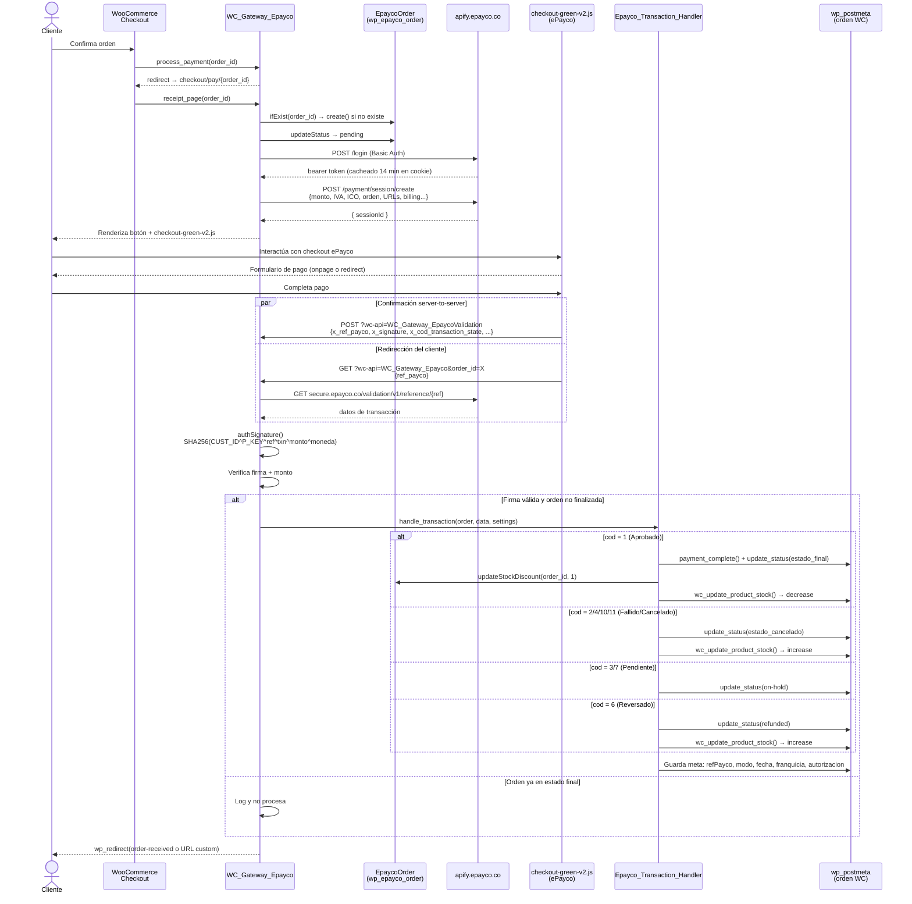
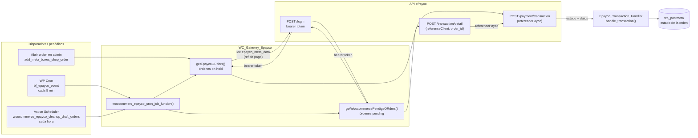
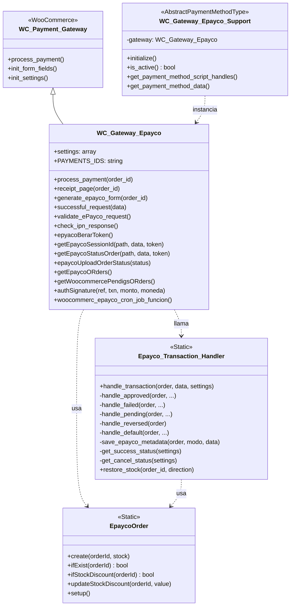

# Diagrama de Interacción — Plugin ePayco WooCommerce

## Flujo completo de pago

```mermaid
sequenceDiagram
    actor Cliente
    participant WC as WooCommerce<br/>Checkout
    participant GW as WC_Gateway_Epayco
    participant EO as EpaycoOrder<br/>(wp_epayco_order)
    participant API as apify.epayco.co
    participant JS as checkout-green-v2.js<br/>(ePayco)
    participant TH as Epayco_Transaction_Handler
    participant DB as wp_postmeta<br/>(orden WC)

    Cliente->>WC: Confirma orden
    WC->>GW: process_payment(order_id)
    GW-->>WC: redirect → checkout/pay/{order_id}

    WC->>GW: receipt_page(order_id)
    GW->>EO: ifExist(order_id) → create() si no existe
    GW->>EO: updateStatus → pending

    GW->>API: POST /login (Basic Auth)
    API-->>GW: bearer token (cacheado 14 min en cookie)

    GW->>API: POST /payment/session/create<br/>{monto, IVA, ICO, orden, URLs, billing...}
    API-->>GW: { sessionId }

    GW-->>Cliente: Renderiza botón + checkout-green-v2.js

    Cliente->>JS: Interactúa con checkout ePayco
    JS-->>Cliente: Formulario de pago (onpage o redirect)
    Cliente->>JS: Completa pago

    par Confirmación server-to-server
        JS->>GW: POST ?wc-api=WC_Gateway_EpaycoValidation<br/>{x_ref_payco, x_signature, x_cod_transaction_state, ...}
    and Redirección del cliente
        JS->>GW: GET ?wc-api=WC_Gateway_Epayco&order_id=X<br/>{ref_payco}
        GW->>API: GET secure.epayco.co/validation/v1/reference/{ref}
        API-->>GW: datos de transacción
    end

    GW->>GW: authSignature()<br/>SHA256(CUST_ID^P_KEY^ref^txn^monto^moneda)
    GW->>GW: Verifica firma + monto

    alt Firma válida y orden no finalizada
        GW->>TH: handle_transaction(order, data, settings)
        alt cod = 1 (Aprobado)
            TH->>DB: payment_complete() + update_status(estado_final)
            TH->>EO: updateStockDiscount(order_id, 1)
            TH->>DB: wc_update_product_stock() → decrease
        else cod = 2/4/10/11 (Fallido/Cancelado)
            TH->>DB: update_status(estado_cancelado)
            TH->>DB: wc_update_product_stock() → increase
        else cod = 3/7 (Pendiente)
            TH->>DB: update_status(on-hold)
        else cod = 6 (Reversado)
            TH->>DB: update_status(refunded)
            TH->>DB: wc_update_product_stock() → increase
        end
        TH->>DB: Guarda meta: refPayco, modo, fecha, franquicia, autorizacion
    else Orden ya en estado final
        GW->>GW: Log y no procesa
    end

    GW-->>Cliente: wp_redirect(order-received o URL custom)
```

---

## Sincronización periódica por Cron

```mermaid
flowchart LR
    subgraph CRON["Disparadores periódicos"]
        WP_CRON["WP Cron\nbf_epayco_event\ncada 5 min"]
        AS["Action Scheduler\nwoocommerce_epayco_cleanup_draft_orders\ncada hora"]
        ADMIN["Abrir orden en admin\nadd_meta_boxes_shop_order"]
    end

    subgraph GW["WC_Gateway_Epayco"]
        FUNC["woocommerc_epayco_cron_job_funcion()"]
        ON_HOLD["getEpaycoORders()\nórdenes on-hold"]
        PENDING["getWoocommercePendigsORders()\nórdenes pending"]
    end

    subgraph API["API ePayco"]
        LOGIN["POST /login\nbearer token"]
        TXN["POST /payment/transaction\n{referencePayco}"]
        DETAIL["POST /transaction/detail\n{referenceClient: order_id}"]
    end

    TH["Epayco_Transaction_Handler\nhandle_transaction()"]
    DB[("wp_postmeta\nestado de la orden")]

    WP_CRON --> FUNC
    AS --> FUNC
    ADMIN --> ON_HOLD

    FUNC --> ON_HOLD
    FUNC --> PENDING

    ON_HOLD -->|"lee epayco_meta_data\n(ref de pago)"| LOGIN
    PENDING --> LOGIN
    LOGIN -->|"bearer token"| ON_HOLD
    LOGIN -->|"bearer token"| PENDING

    ON_HOLD --> TXN
    PENDING --> DETAIL
    DETAIL -->|"referencePayco"| TXN
    TXN -->|"estado + datos"| TH
    TH --> DB
```

---

## Clases y responsabilidades

```mermaid
classDiagram
    class WC_Payment_Gateway {
        <<WooCommerce>>
        +process_payment()
        +init_form_fields()
        +init_settings()
    }

    class WC_Gateway_Epayco {
        +settings: array
        +PAYMENTS_IDS: string
        +process_payment(order_id)
        +receipt_page(order_id)
        +generate_epayco_form(order_id)
        +successful_request(data)
        +validate_ePayco_request()
        +check_ipn_response()
        +epyacoBerarToken()
        +getEpaycoSessionId(path, data, token)
        +getEpaycoStatusOrder(path, data, token)
        +epaycoUploadOrderStatus(status)
        +getEpaycoORders()
        +getWoocommercePendigsORders()
        +authSignature(ref, txn, monto, moneda)
        +woocommerc_epayco_cron_job_funcion()
    }

    class Epayco_Transaction_Handler {
        <<Static>>
        +handle_transaction(order, data, settings)
        -handle_approved(order, ...)
        -handle_failed(order, ...)
        -handle_pending(order, ...)
        -handle_reversed(order)
        -handle_default(order, ...)
        -save_epayco_metadata(order, modo, data)
        -get_success_status(settings)
        -get_cancel_status(settings)
        +restore_stock(order_id, direction)
    }

    class EpaycoOrder {
        <<Static>>
        +create(orderId, stock)
        +ifExist(orderId) bool
        +ifStockDiscount(orderId) bool
        +updateStockDiscount(orderId, value)
        +setup()
    }

    class WC_Gateway_Epayco_Support {
        <<AbstractPaymentMethodType>>
        -gateway: WC_Gateway_Epayco
        +initialize()
        +is_active() bool
        +get_payment_method_script_handles()
        +get_payment_method_data()
    }

    WC_Payment_Gateway <|-- WC_Gateway_Epayco
    WC_Gateway_Epayco ..> Epayco_Transaction_Handler : llama
    WC_Gateway_Epayco ..> EpaycoOrder : usa
    WC_Gateway_Epayco_Support ..> WC_Gateway_Epayco : instancia
    Epayco_Transaction_Handler ..> EpaycoOrder : usa
```
